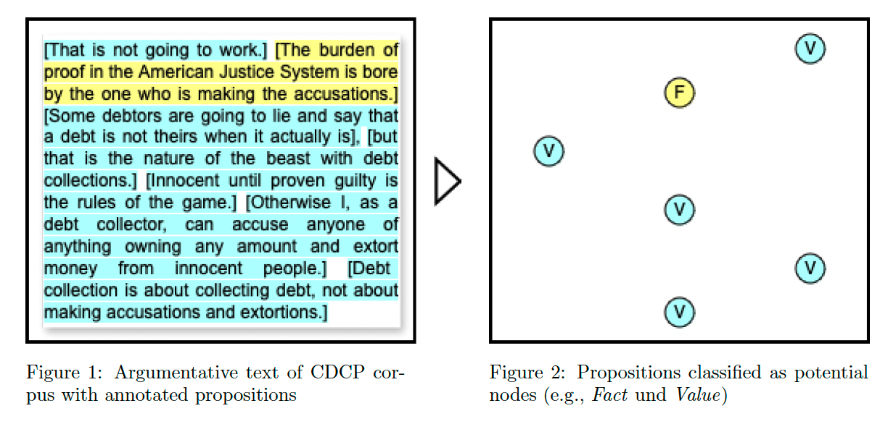
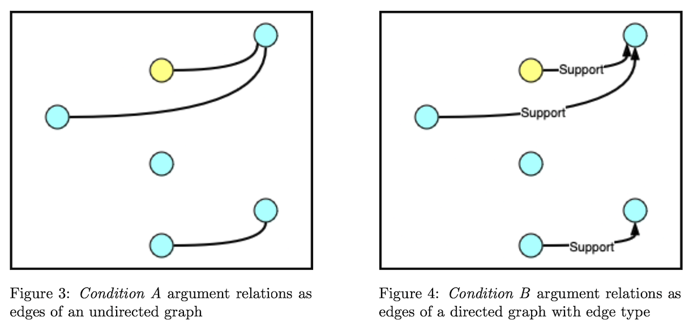
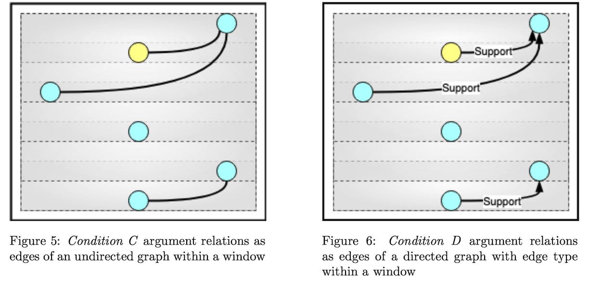
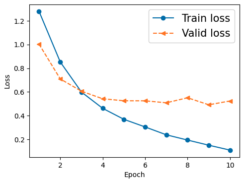
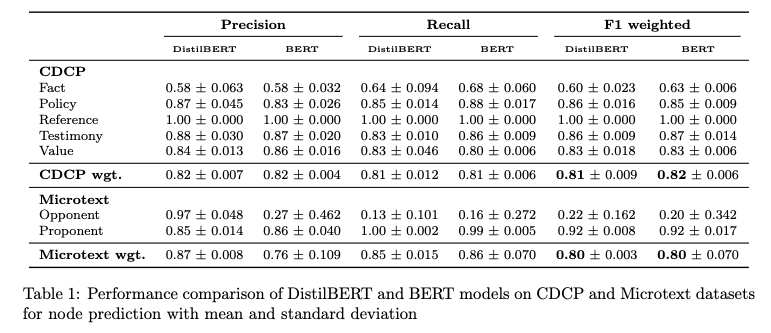
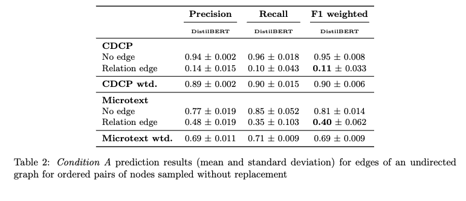
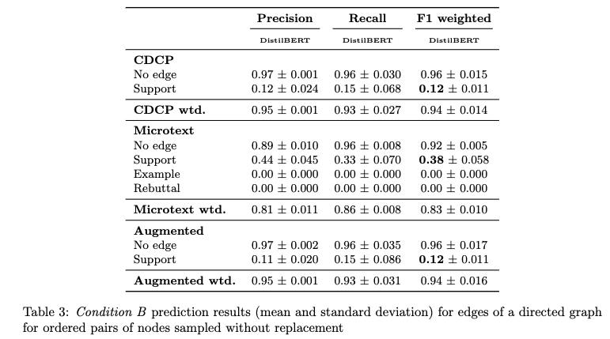
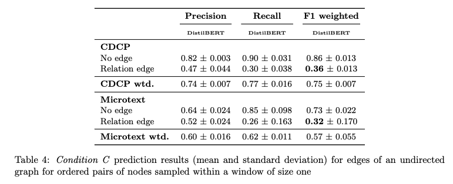
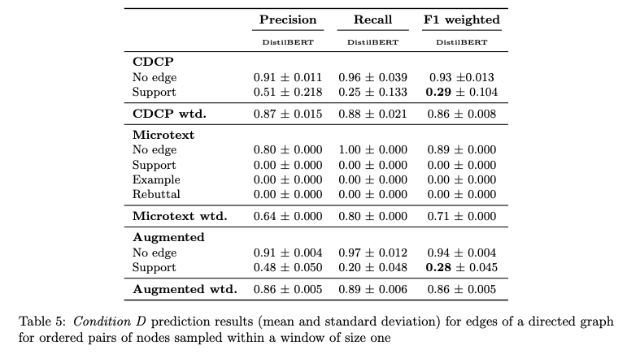
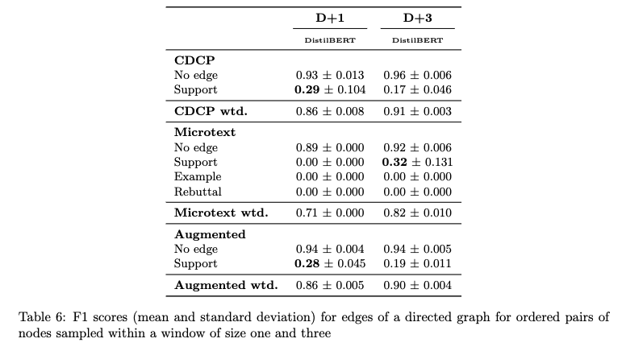

# Argument Mining with BERT classification

The goal of this project is to classify propositions (**task one**) and 
their argumentative relations (**task two**). This is being done with the 
following assumptions: A proposition (e. g., of type `Value` or 
`Proponent` -- depending on the annotation of the corpus data) can be 
understood as a potential node of an argument graph; an argument relation can 
be understood as a potential edge between two such nodes. To identify both
propositions and relations, different classification tasks are introduced 
(consider **Experimental setting**). 

Argumentation is loosely defined here as the communicative practice of 
presenting reasons and evidence to support or oppose claims, that is 
controversial statements. For example, such statements could be bolstered with 
additional reasons or challenged with counter-evidence. From the 
relational structure of propositions, we can derive the function of the 
proposition, that is, whether they serve as claims or premises. However, 
this is not the focus of the present work as it is limited to task one and task
two. But these tasks allow to easily infer the argumentative function in the 
previously mentioned fashion.

This project is being realized with two different corpora of annotated 
arguments, the *Cornell eRulemaking Corpus – CDCP* and the *Argumentative 
Microtext Corpus* (consider **Data**).

Three hypotheses are evaluated with the test results from the trained 
classifiers and Welch's one-tailed t-tests (consider 
`results/hypotheses_test.R`) given their respective tasks.

>**H1** Model size) The classification of nodes, that is propositions,
can be improved with training and testing on the larger BERT model compared to 
DistilBERT.

CDCP: H1 is rejected.\
Microtext: H1 is rejected.

>**H2** Window clipping) The classification of directed and typed edges, that 
 is, argument relations that are not None, can be improved when training and 
testing are done with a window for neighboring nodes with a window-size of d=1.

CDCP: H2 can be confirmed for `support` relations with a p-value of **0.0526** 
and 
a 95% confidence interval. \
Microtext: H2 is rejected for all relation types.

>**H3** Data augmentation) The classification of directed and typed edges, 
that is, argument relations that are not None, can be improved when 
training and testing are done with a window for neighboring nodes with a 
window-size of d=1 AND when the data of the corpus is augmented.

CDCP: H3 is rejected. \
Microtext: H3 is rejected.

Terminology:

**EDU** = elementary discourse unit \
**ADU** = argumentation discourse unit

## Version

The project was developed with Python **3.11**. The required dependencies 
can be installed with `pip install -r requirements.txt --upgrade`. The 
Jupyter notebooks for the fine-tuning pipelines are written to be used in 
Google Colab.

## Data
The corpora with annotated arguments used in the experiments are 
automatically downloaded and saved at `data/` through the notebooks. For 
references, please consider **References**.

1) Cornell eRulemaking Corpus – CDCP, available here:
https://facultystaff.richmond.edu/~jpark/data/cdcp_acl17.zip.

2) Argumentative Microtext Corpus Part One, available here:
https://github.com/peldszus/arg-microtexts/archive/refs/heads/master.zip

3) Argumentative Microtext Corpus Part Two, available here:
https://github.com/discourse-lab/arg-microtexts-part2/archive/refs/heads/master.zip

The corpus statistics are reported in the respective Jupyter notebooks.

## Experimental setting

Classifying propositions and relations is being realized with different 
scenarios. Consider the following figures:

## Models

The classifiers used for the experiments are fine-tuned [BERT](https://huggingface.co/google-bert/bert-base-uncased) 
and [DistilBERT](https://huggingface.co/distilbert/distilbert-base-uncased)
models implemented by HuggingFace. AdamW with a 5e^-5 learning rate was 
chosen as the optimizer. The batch size of each model training was 128. All 
models were trained for five epochs and the learning rate was linearly 
reduced over the training steps. All models are trained and tested three 
times with different random seeds.

Five epochs were considered to be sufficient after manual evaluation has shown 
that the models validation losses plateaued after about five epochs.

The training was performed using an NVIDIA L4 GPU, and an NVIDIA A100-SXM4-40GB
GPU when resources were available.

## Results

The following results are reported for the experiments.

## References

(1) Joonsuk Park and Claire Cardie. 2018. A Corpus of eRulemaking User Comments
for Measuring Evaluability of Arguments. In Proceedings of the Eleventh
International Conference on Language Resources and Evaluation (LREC 2018),
Miyazaki, Japan. European Language Resources Association (ELRA).

(2) Andreas Peldszus and Manfred Stede. An annotated corpus of argumentative
microtexts. In D. Mohammed, and M. Lewinski, editors, Argumentation and
Reasoned Action - Proc. of the 1st European Conference on Argumentation,
Lisbon, 2015. College Publications, London, 2016

(3) Maria Skeppstedt, Andreas Peldszus and Manfred Stede. More or less
controlled elicitation of argumentative text: Enlarging a microtext corpus via
crowdsourcing. In Proc. 5th Workshop in Argumentation Mining (at EMNLP),
Brussels, 2018

